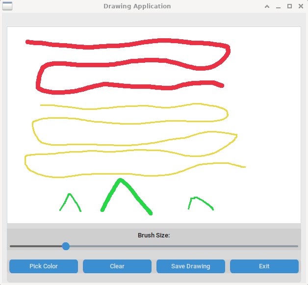

# customtkinter Drawing App GUI

This is a customtkinter GUI base app implementation from [here](https://dailypythonprojects.substack.com/) for a drawing app.

## TODO
- [] Solve Canvas/custom widgets for MVC implementation (Dark mode).
- [] Saving dialog
- [] ~~Dark mode~~
- [] Resizing